# Documentação do Projeto Flask
-

**Visão Geral**
Este projeto é uma aplicação web básica construída com Flask, utilizando a arquitetura MVC. Ele inclui funcionalidades de autenticação, registro de usuários e uma página inicial protegida que só pode ser acessada após o login.

## Requisitos
Python 3.6+
Flask
Flask-WTF
Flask-Login
Flask-SQLAlchemy
Flask-Migrate
Werkzeug
SQLite (para o banco de dados)

**Estrutura do Projeto**

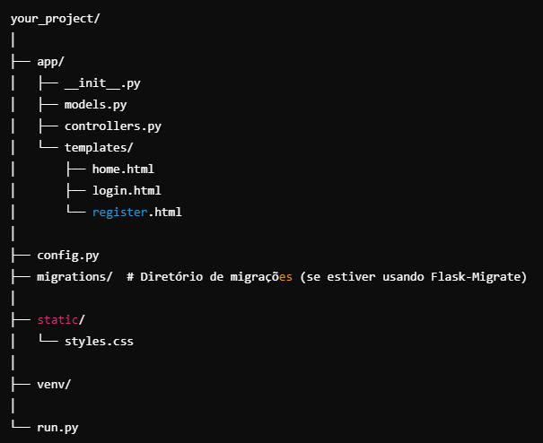

**Configuração**

**1. Instalação das Dependências**
Crie um ambiente virtual e instale as dependências necessárias:

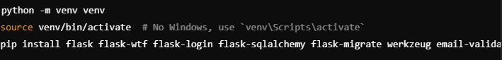

**2. Configuração do Banco de Dados**
O projeto utiliza SQLite por padrão. Configure a URI do banco de dados e a chave secreta no arquivo <u>config.py:</u>

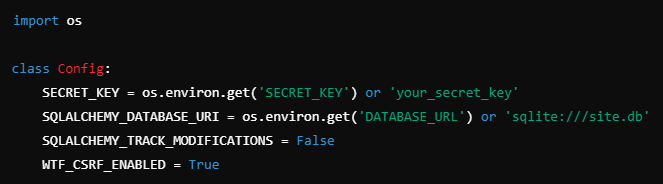

**3. Inicialização do Banco de Dados**
Se estiver usando migrações com **Flask-Migrate:**

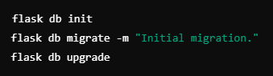

Se não estiver usando migrações, crie as tabelas manualmente:

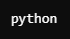

No shell Python:

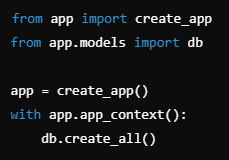

**Estrutura de Arquivos**

**run.py**

Arquivo para iniciar a aplicação Flask.

**run.py:**

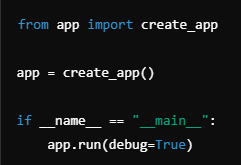

**app/__init__.py**

Configura a aplicação Flask, o banco de dados e o Flask-Login.

**app/__init__.py:**

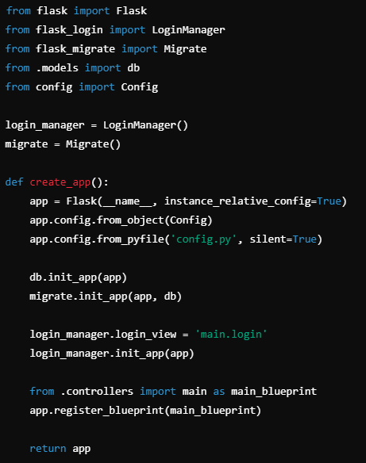

**app/models.py**

Define o modelo de dados e a configuração do banco de dados.

**app/models.py:**

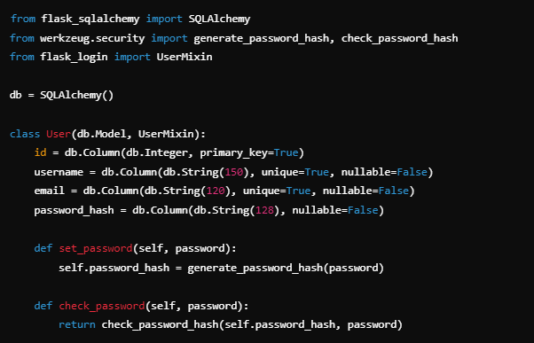

**app/controllers.py**

Define as rotas e a lógica de autenticação.

**app/controllers.py:**

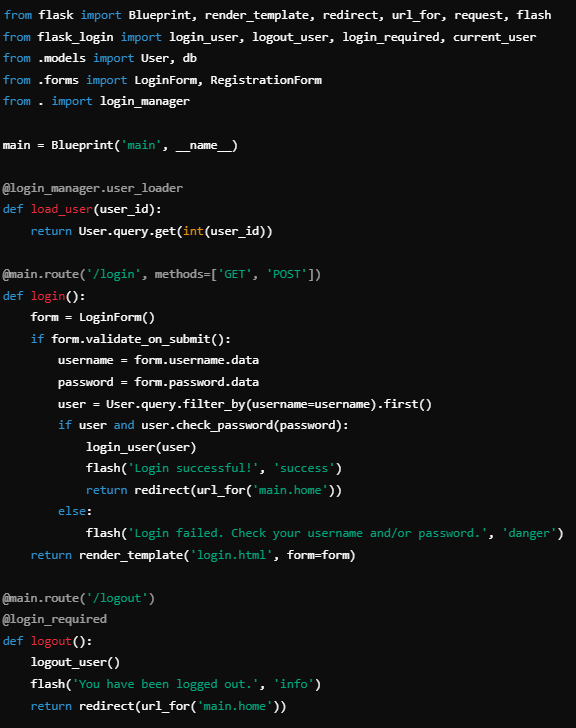

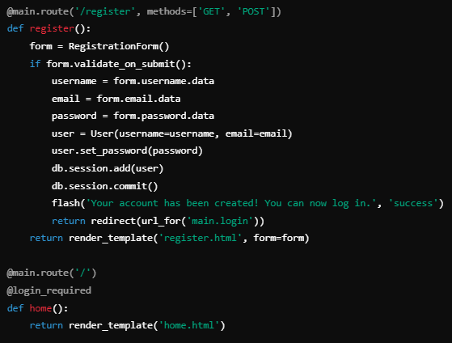

**app/templates/home.html**

Template para a página inicial.

**app/templates/home.html:**

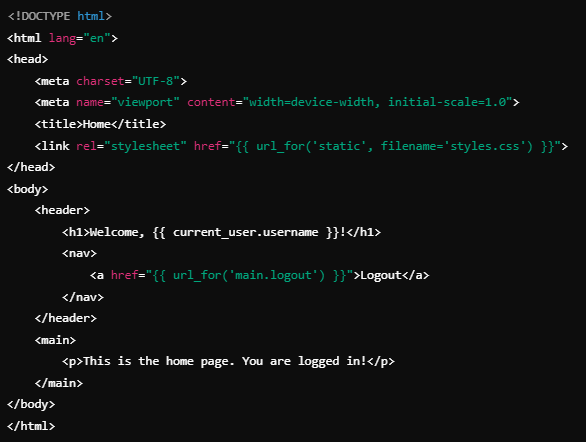

**app/templates/login.html** e **app/templates/register.html**

Templates para login e registro.

**app/static/styles.css**

Arquivo CSS para estilização.

**app/static/styles.css:**

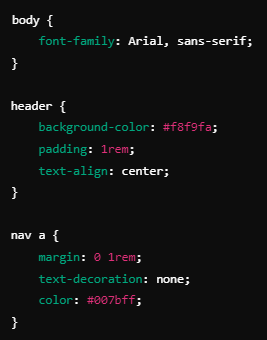

**Uso**

Inicie o ambiente virtual:

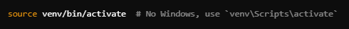

Inicie a aplicação Flask:

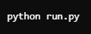

Acesse a aplicação no navegador em http://127.0.0.1:5000.

**Contribuição**
Se você quiser contribuir para o projeto, sinta-se à vontade para fazer um fork e enviar um pull request. Para quaisquer problemas ou sugestões, abra uma issue no repositório.

---
